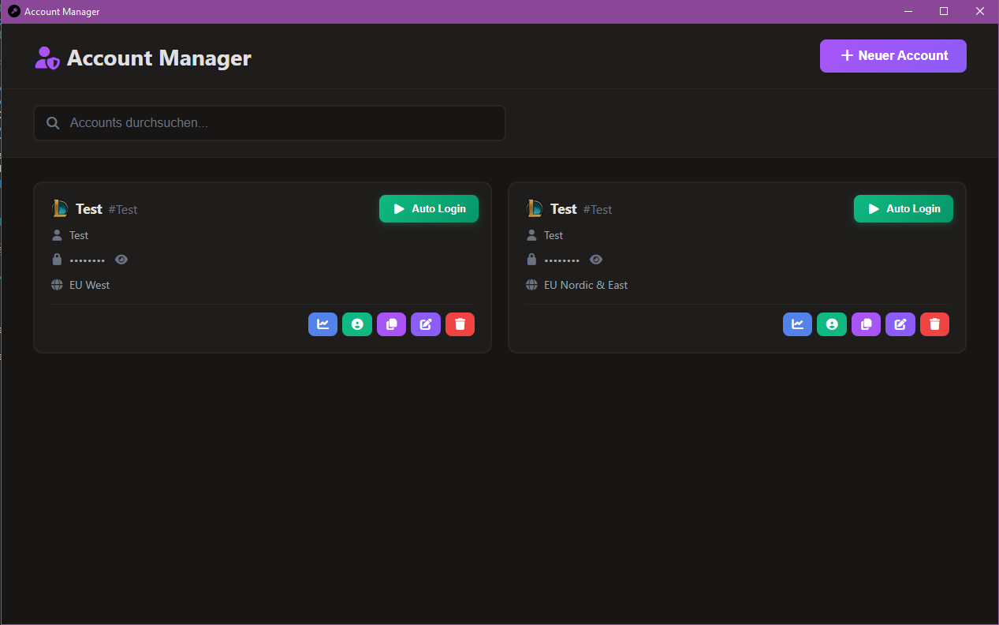

# 🎮 League Account Manager

Ein Account Manager für League of Legends mit Auto-Login Funktion.

## ✨ Features

- 🚀 **Auto-Login Funktion** - Automatischer Login in den Riot Client mit einem Klick
- 🔍 **Schnelle Suche** - Filtere Accounts nach Name, Tag, Username oder Region
- 📋 **Clipboard Support** - Kopiere Username und Passwort mit einem Klick
- 🔄 **Auto-Update** - Automatische Update-Benachrichtigung über GitHub Releases
- 💾 **Lokale Datenspeicherung** - Alle Daten werden lokal gespeichert

## 📸 Screenshots

## 🚀 Installation

### Option 1: Fertige Anwendung

1. Lade die neueste Version von den [Releases](https://github.com/Tuc2300/LeagueAccountManager/releases) herunter
2. Extrahiere die ZIP-Datei oder starte die `.exe` direkt
3. Fertig! Die Anwendung ist sofort einsatzbereit